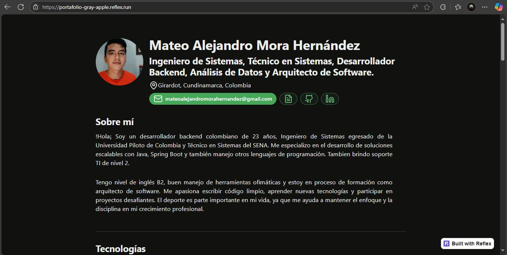
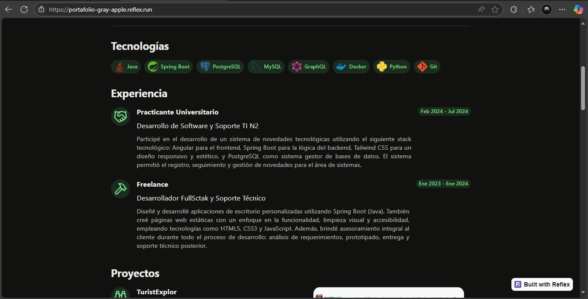
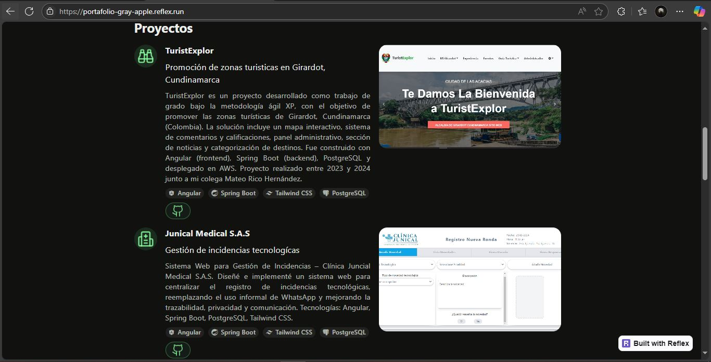
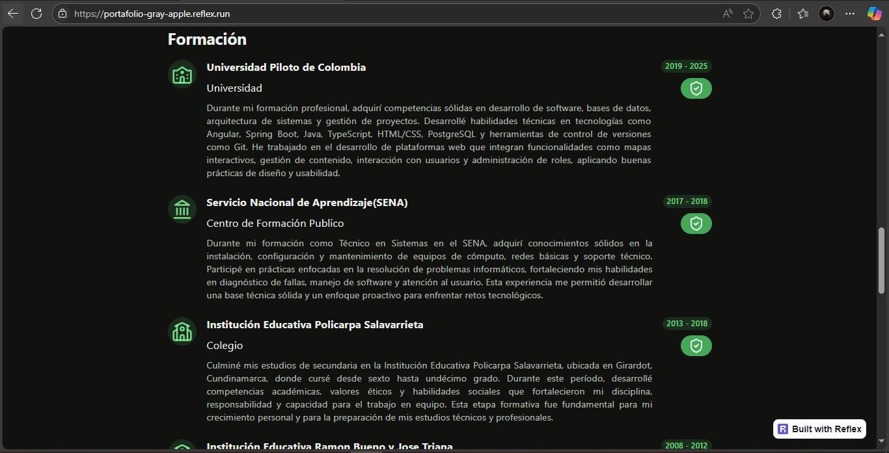
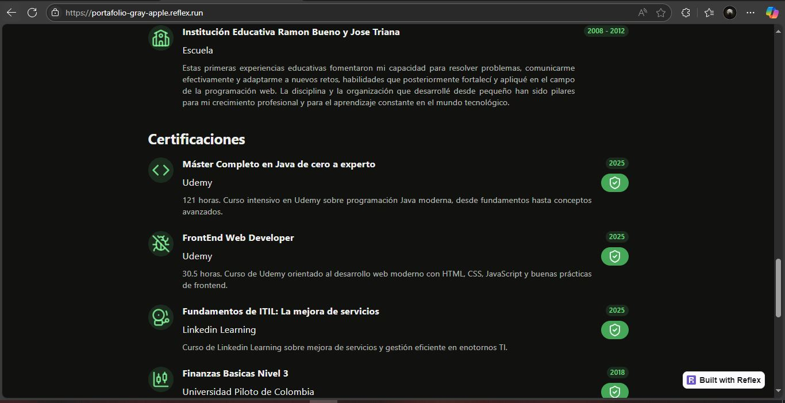
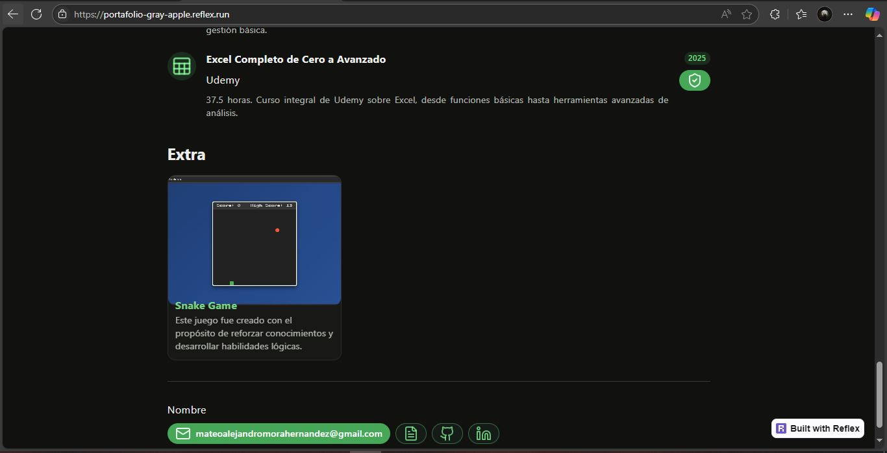

# PORTAFOLIO MINIMALISTA

Este es un proyecto de portafolio personal desarrollado con un enfoque minimalista, enfocado en destacar habilidades, proyectos y experiencia de manera clara y profesional.

## 🛠 Tecnologías utilizadas

- Python
- Reflex
- JavaScript
- HTML
- Tailwind

## 🚀 Cómo ejecutar el proyecto

Clona el proyecto, crea un entorno virtual, instala Reflex y ejecútalo para acceder al proyecto desde http://localhost:3000.

- pip install reflex

- reflex init

- reflex run

# Proyecto

# Creditos

Este proyecto está inspirado en el trabajo de [@mouredev](https://github.com/mouredev), quien comparte excelentes retos de programación.

